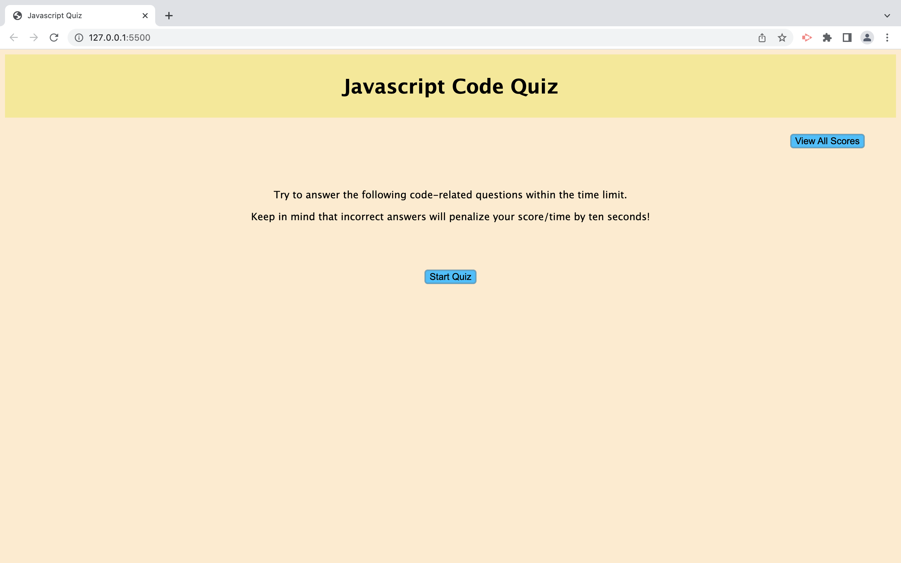

# Javascript Quiz

## user Story 

* Users should be able to take a timed quiz on Javascript fundamentals that stores high scores, SO That I can guage the progress compared to peers.

## Acceptance Criteria 

Test knowledge on Javascript with this Quiz page:
Display instructions and Start Quiz button. In addition, allow users to view previous all users scores.
WHEN user clicks on start Quiz button, THEN a timer starts and presented with a question
WHEN user answers a question, THEN user is able to see result for that question and THEN next quesiton shall be presented 
WHEN user answers a question incorrect, THEN time(10 seconds) is subtracted from clock and THEN next question shall be presented
WHEN user answers all questions or WHEN timer reaches 0, THEN present the score to user and gather the initials 
WHEN user clicks on View all score button, THEN user is presented with highscore acquired
WHEN user clicks clear all scores, THEN no details shall be presented on view highscore click
At any time, present an option for user to Goback to main page

## Mock-Up screens:

* Home Page

* Question page

* Result for question page

* Score Page

* End of Quiz page

* All score page

github URL: https://github.com/Sivaparam/Javascript-Quiz

Live URL: https://sivaparam.github.io/Javascript-Quiz/
